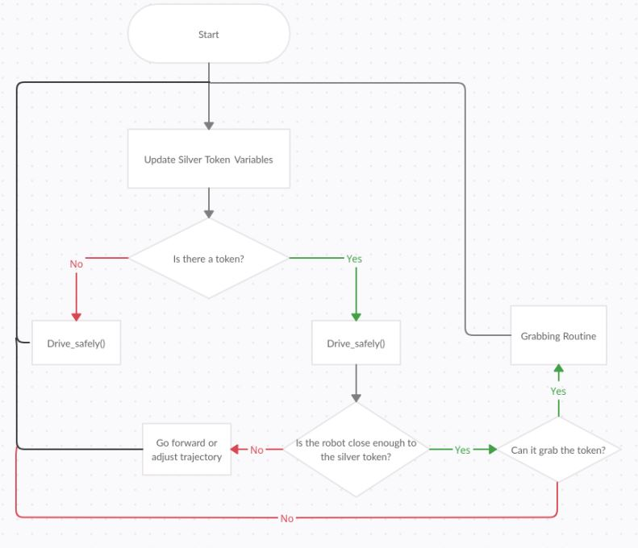
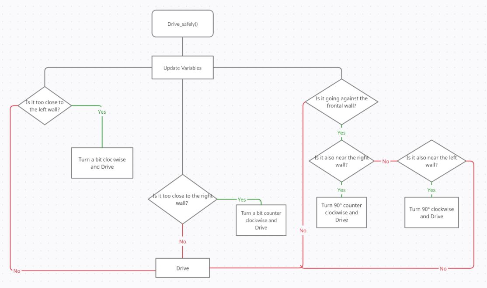

RT1 FIRST ASSIGNMENT
================================

The main task of this assignment, given by the Professor Recchiuto, is to make the HOLONOMIC robot moves counterclockwisely in the virtual environment that he has presented. In this environment there are golden and silver tokens; the robot MUST avoid the golden tokens, that are regarded as WALLS, whereas it has to grab and release (thanks to specific commands) the silver ones, letting them behind itself.

Installing and running
----------------------

The simulator requires a Python 2.7 installation, the [pygame](http://pygame.org/) library, [PyPyBox2D](https://pypi.python.org/pypi/pypybox2d/2.1-r331), and [PyYAML](https://pypi.python.org/pypi/PyYAML/).

Pygame, unfortunately, can be tricky (though [not impossible](http://askubuntu.com/q/312767)) to install in virtual environments. If you are using `pip`, you might try `pip install hg+https://bitbucket.org/pygame/pygame`, or you could use your operating system's package manager. Windows users could use [Portable Python](http://portablepython.com/). PyPyBox2D and PyYAML are more forgiving, and should install just fine using `pip` or `easy_install`.

## Troubleshooting

When running `python run.py <file>`, you may be presented with an error: `ImportError: No module named 'robot'`. This may be due to a conflict between sr.tools and sr.robot. To resolve, symlink simulator/sr/robot to the location of sr.tools.

On Ubuntu, this can be accomplished by:
* Find the location of srtools: `pip show sr.tools`
* Get the location. In my case this was `/usr/local/lib/python2.7/dist-packages`
* Create symlink: `ln -s path/to/simulator/sr/robot /usr/local/lib/python2.7/dist-packages/sr/`

## Running the program
-----------------------------

```bash

$ python run.py assignment.py

```

Robot API
---------

The API for controlling a simulated robot is designed to be as similar as possible to the [SR API][sr-api].

### Motors ###

The simulated robot has two motors configured for skid steering, connected to a two-output [Motor Board](https://studentrobotics.org/docs/kit/motor_board). The left motor is connected to output `0` and the right motor to output `1`.

The Motor Board API is identical to [that of the SR API](https://studentrobotics.org/docs/programming/sr/motors/), except that motor boards cannot be addressed by serial number. So, to turn on the spot at one quarter of full power, one might write the following:

```python
R.motors[0].m0.power = 25
R.motors[0].m1.power = -25
```

### The Grabber ###

The robot is equipped with a grabber, capable of picking up a token which is in front of the robot and within 0.4 metres of the robot's centre. To pick up a token, call the `R.grab` method:

```python
success = R.grab()
```

The `R.grab` function returns `True` if a token was successfully picked up, or `False` otherwise. If the robot is already holding a token, it will throw an `AlreadyHoldingSomethingException`.

To drop the token, call the `R.release` method.

Cable-tie flails are not implemented.

### Vision ###

To help the robot find tokens and navigate, each token has markers stuck to it, as does each wall. The `R.see` method returns a list of all the markers the robot can see, as `Marker` objects. The robot can only see markers which it is facing towards.

Each `Marker` object has the following attributes:

* `info`: a `MarkerInfo` object describing the marker itself. Has the following attributes:
  * `code`: the numeric code of the marker.
  * `marker_type`: the type of object the marker is attached to (either `MARKER_TOKEN_GOLD`, `MARKER_TOKEN_SILVER` or `MARKER_ARENA`).
  * `offset`: offset of the numeric code of the marker from the lowest numbered marker of its type. For example, token number 3 has the code 43, but offset 3.
  * `size`: the size that the marker would be in the real game, for compatibility with the SR API.
* `centre`: the location of the marker in polar coordinates, as a `PolarCoord` object. Has the following attributes:
  * `length`: the distance from the centre of the robot to the object (in metres).
  * `rot_y`: rotation about the Y axis in degrees.
* `dist`: an alias for `centre.length`
* `res`: the value of the `res` parameter of `R.see`, for compatibility with the SR API.
* `rot_y`: an alias for `centre.rot_y`
* `timestamp`: the time at which the marker was seen (when `R.see` was called).

For example, the following code lists all of the markers the robot can see:

```python
markers = R.see()
print "I can see", len(markers), "markers:"

for m in markers:
    if m.info.marker_type in (MARKER_TOKEN_GOLD, MARKER_TOKEN_SILVER):
        print " - Token {0} is {1} metres away".format( m.info.offset, m.dist )
    elif m.info.marker_type == MARKER_ARENA:
        print " - Arena marker {0} is {1} metres away".format( m.info.offset, m.dist )
```

[sr-api]: https://studentrobotics.org/docs/programming/sr/

Methods
---------

### FUNCTIONS
All functions used for the code are well documented in the folders **html** and
**latex** done with the software tool Doxywizard. Hereafter the flowchart of the 
code.

### FLOWCHART

These are respectively the flowcharts of the while loop that controls the robot
and the drive_safely() function.





Main()
---------

It is not properly the main function but here it is state the logic of what
the robot should do after defined the functions.
Robot continuosly retrieves the distance and angle of a silver token 
that it detects, after it starts drive in the circuit counterclockwise.
drive_safely() permits to avoid golden tokens during the run.
All numeric values are put in the code after testing many times the 
simulation.

Here is where problems arise:
1. This script doesn't work for general maps, it is specific for this 
  environment and succed in solving the requests.
2. Sensors' retrieve only a distance and an angle so the error rate is high.


```python
while 1:
    
	dist, rot_y = find_silver_token() 
	#print for retrieve information about angle and distances to see if the conditions are met	
        #markers = R.see()
	#print ("I can see", len(markers), "markers:")
    	#for m in markers:
    		#if m.info.marker_type in (MARKER_TOKEN_SILVER):
    			#print( " - Angle {0} {1} metres away".format( m.rot_y, m.dist ))
        if(dist == -1):
        	#print("I see a handful of flies")
        	drive_safely()
        else:    
		drive_safely()
              	
        	if dist <d_th: # if we are close to the token, we try grab it.
        		print("Found it!")
        		if R.grab(): # if we grab the token, we move the robot forward and behind, we release the token, and we go back to the initial position
        	        	print("Gotcha!")
				turn(30, 1.999)
	                	drive(40,0.25)
	        		R.release()
                		drive(-40,0.25)
	            		turn(-30, 1.999)
                    	
	        	else:
                		print("Aww, I'm not close enough.")
        	elif -a_th<= rot_y <= a_th: # if the robot is well aligned with the token, we go forward
	        	print("Ah, that'll do.")
                	drive(100, 0.05)
        	elif rot_y < -a_th: # if the robot is not well aligned with the token, we move it on the left or on the right
        		print("Left a bit...")
                	turn(-8, 0.125)
        	elif rot_y > a_th:
                	print("Right a bit...")
        		turn(+8, 0.125)
```
